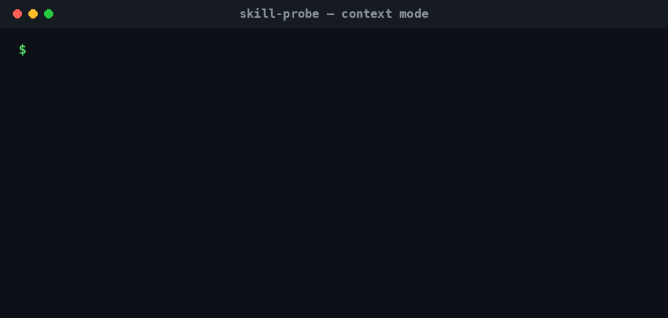

# skill-probe

Runtime-agnostic, **co-loaded-aware** auditor for an AI agent's skill library. It measures
which skill *actually* fires (by real activation, not keyword matching) when your whole
`SKILL.md` library is loaded together — with **statistical confidence**, not single-shot guesses.



> **Your skill works alone. Does it still work when the whole library is loaded?**

> Most skill tooling tests one skill, in isolation, once. Skills only conflict when loaded
> *together*, and activation is *stochastic*. skill-probe is the tool that tests the real thing.

Complements static linters like `skill-audit` (security/quality) — this is **behavioral**.

> **How it works / requirements.** skill-probe is a **terminal CLI**, *not* an in-agent slash
> command. It drives your local runtime CLI under the hood, so you need that runtime installed and
> authenticated: **`claude`** (logged in) for `runtime: claude-code`, or **`opencode`** for
> `runtime: opencode`. `gen`/`fix`/`diagnose` use `ANTHROPIC_API_KEY` if set, otherwise the local `claude` CLI.
> Codex/Gemini runtimes aren't supported yet (their traces don't expose which skill fired).

The workflow:

```text
doctor → gen → audit → context → diagnose → fix
```

- `doctor`: verify setup, auth, runtime, skills, and config before spending probes.
- `gen`: draft a probe config from your existing skills.
- `audit`: measure which skill actually fires when the whole library is co-loaded — with
  `--baseline`, gate CI on statistically significant regressions only.
- `context`: compare isolation vs co-loaded activation to catch library interference —
  add `--ablate` to name **which** sibling is stealing the trigger.
- `diagnose`: explain whether a failure is a routing miss or a description problem.
- `fix`: rewrite a skill description and keep it only if the measured reliability improves.

## Why

- Skill activation is stochastic: the same prompt can produce different skill-routing outcomes.
- A single run lies (we measured the same prompt at 0/5 one batch, 2/3 the next).
- skill-probe runs each prompt **k times**, reports a **Wilson 95% CI**, stops early when the
  result is statistically decided, and flags **trigger-theft** (a sibling stealing a trigger).

## Install

```bash
npm i -g skill-probe      # or: npx skill-probe
```

## Start here (`skill-probe doctor`)

Run this first — it catches the setup problems (no skills dir, runtime not installed or not
authenticated, a config typo) before you spend any probes:

```bash
skill-probe doctor --cwd .                      # check the project + runtime
skill-probe doctor --config probe.config.json   # also sanity-check a config
```

```
skill-probe doctor

PASS  Node 22.18.0
PASS  config parsed: probe.config.json
PASS  found .claude/skills/ with 4 skills
PASS  expected skills all exist
PASS  claude CLI found
PASS  claude-code probe succeeded (CLI is authenticated)
WARN  threshold 90% with k=10 cannot certify a pass — need ~k=35
FAIL  skill "greeter" missing description:
```

It checks: Node version, `.claude/skills/` exists, every skill has a `SKILL.md` with `name:` +
`description:`, names match folders, the config parses, every `expected` skill exists, the
threshold/k are statistically achievable, the runtime CLI is installed, and a harmless live probe
authenticates. Exit `0` healthy · `1` warnings only · `2` hard failures. Use `--skip-probe` to skip
the live (costing) auth check.

## Generate a config (`skill-probe gen`)

Don't want to hand-write the cases? Draft them from your skills, then review:

```bash
skill-probe gen --cwd . > probe.config.json
```
It reads each `.claude/skills/*/SKILL.md`, and an LLM drafts realistic should-fire prompts per
skill, cross-skill **near-misses** (to surface mis-routing), and off-topic **decoys**. Hallucinated
skill names are dropped automatically. Flags: `--per-skill <n>` (default 3), `--decoys <n>`
(default 2), `--model <id>`.

> **Always review the draft before running.** Generators lean toward obvious keyword-matches; you
> add the messy, oblique phrasings real users type (that's where triggering actually fails).

`gen`, `fix`, and `diagnose` use `ANTHROPIC_API_KEY` if it's set, otherwise they fall back to the
logged-in **`claude` CLI** — so on a Claude subscription the whole tool works with **no API key at
all**.

## Use

```bash
# point it at your own config (after `npm i -g skill-probe`):
skill-probe --config my.config.json --k 10 --threshold 0.7 --json

# or, from a clone of this repo, try the bundled example (needs `claude` installed + auth):
skill-probe --config examples/audit.config.json
```

Config (`skill-probe.config.json`):
```json
{
  "runtime": "claude-code",
  "cwd": "./my-project",
  "k": 10, "threshold": 0.7, "conf": 0.95,
  "cases": [
    { "prompt": "write a commit message", "expected": "commit-writer" },
    { "prompt": "what's the weather?", "expected": null }
  ]
}
```
Output:
```
skill-probe — runtime: claude-code  model: (runtime default)  threshold: 70%

  PASS          expect=commit-writer  | write a commit message
        reliability 100% [72%, 100%] k=10
        outcomes: commit-writer×10
  FAIL          expect=pr-describer  | write a pull request description
        reliability 20% [6%, 51%] k=10
        outcomes: None×8, commit-writer×2
        ⚠ trigger-theft by: commit-writer
  PASS          expect=(none)  | what's the weather?
        reliability 100% [72%, 100%] k=10
        outcomes: None×10

Result: 2 pass / 1 fail / 0 inconclusive / 0 error  |  exit 1  |  cost $0.18
```

- `cwd` (relative paths resolve against the **config file's** directory) is a project dir
  containing `.claude/skills/`.
- `expected: null` = a decoy that should fire nothing.
- Exit code: `0` all pass, `1` a behavioral fail / trigger-theft, `2` inconclusive or an
  infrastructure error (runtime down → never a silent pass).

**Output options:** a live `probing [2/3] …` progress line prints to stderr while it runs (use
`--quiet` to silence it). `--markdown` emits a table you can paste into a PR/README; `--json`
for machine output; `--no-cost` hides the cost line (handy on a Claude subscription, where the
dollar figure is just an estimate, not a charge).

**Cross-runtime comparison must pin the model.** A skill can fire on one runtime and not another
partly because of the *model*, not the runtime. Always set `model` (recorded in the report) so a
Claude Code vs OpenCode comparison is fair — otherwise you're comparing two confounded variables.

**Two modes** — because confidence intervals are wide at small k:
- **Smoke (default):** `threshold 0.7, k 10` — a clean run certifies; cheap; good for CI.
- **Certify:** a strict bar needs more runs. To certify **≥0.9** you need **~k=35**; when a
  case is inconclusive the report prints the exact k for your threshold. Don't set `threshold
  0.9, k 10` and expect a pass — that's statistically impossible and the tool will say so.

## CI usage

skill-probe exits non-zero on a real problem, so it drops straight into a pipeline. Exit codes:
**`0`** all pass · **`1`** a behavioral fail / trigger-theft / interference / regression · **`2`**
inconclusive or an infrastructure error — so a runtime outage *fails* the build instead of silently
passing. Add `--json` to archive the full result (it includes a **run manifest**: tool version,
model, date, config hash — so two runs are comparable and a report is citable).

### Regression gating (`--baseline`)

The CI question isn't "are my skills perfect?" — it's **"did this PR make any skill worse?"**
Activation is stochastic, so comparing raw rates makes CI flaky. The baseline gate compares each
case against a saved baseline with **Fisher's exact test, Benjamini-Hochberg corrected** — noise
passes, real drops fail:

```bash
# once, on a good main build (commit the file):
skill-probe --config probe.config.json --save-baseline baselines/main.json

# on every PR:
skill-probe --config probe.config.json --baseline baselines/main.json
```

```
Baseline gate — vs baseline saved 2026-07-02T09:12:03Z (skill-probe 0.9.0)
  [▼ REGRESSED]  greeter  | write a birthday greeting
        90% (9/10) → 20% (2/10)   Δ-70%   p=0.005 · adj 0.005
Gate: ▼ FAIL — 1 significant regression(s)
```

The gate warns (but still runs, matching cases by prompt) if the config, runtime, or model changed
since the baseline — apples-to-oranges comparisons are flagged, never silent. Significant
*improvements* are reported too, as a nudge to re-save the baseline.

### GitHub Action

```yaml
# .github/workflows/skills.yml
name: skills
on: pull_request
jobs:
  probe:
    runs-on: ubuntu-latest
    steps:
      - uses: actions/checkout@v4
      - uses: actions/setup-node@v4
        with: { node-version: "22" }
      - uses: HystonKayange/skill-probe@main
        with:
          config: probe.config.json
          args: --baseline baselines/main.json
        env:
          ANTHROPIC_API_KEY: ${{ secrets.ANTHROPIC_API_KEY }}
```

The action installs skill-probe plus the runtime CLI (Claude Code by default; set
`runtime-package: ""` if your runner already has one) and runs the command. `command:` selects
`audit` (default), `context`, `diagnose`, or `doctor`; `args:` passes extra flags like `--ablate`.
The runtime authenticates via `ANTHROPIC_API_KEY` — headless probes each cost real tokens, so
smoke settings (`k: 10`, few cases) are the sweet spot for per-PR gating.

## Activation rate by context (`skill-probe context`)

The audit measures every skill **co-loaded** — the real, hard condition. But a skill can fire
*fine on its own* and only fail *under load*, when the rest of your library is competing for the
same trigger. `context` exposes exactly that:

```bash
skill-probe context --config probe.config.json
```

For each case it measures the expected skill **in isolation** (a throwaway project with only that
one skill) **and co-loaded** (your full library), then tests the drop with **Fisher's exact test**
— so interference is reported as a real effect with a p-value, not eyeballed. Across multiple
cases the p-values are **Benjamini-Hochberg corrected** (one Fisher test per case is a *family*:
raw `p<0.05` over a 40-case library expects ~2 false flags by chance alone — interference is
decided on the adjusted p, and the report shows both):

```
skill-probe context — runtime: claude-code  model: (runtime default)  threshold: 70%  library: 4 skills
  isolation = only that skill loaded · co-loaded = the full library (4) loaded
  3 comparisons — interference decided on Benjamini-Hochberg adjusted p<0.05 (raw p across a family overcounts)

  [⚠ INTERFERENCE]  greeter  | write a birthday greeting
        isolation 100% [72%, 100%] k=10
        co-loaded 30% [11%, 60%] k=10
        Δ -70% under load   Fisher p=0.003 · BH-adj p=0.009
        ↳ fires reliably alone but is suppressed when the library is co-loaded (stolen by: welcomer)

Result: 1 interference / 3 measured  |  exit 1
```

This is the "fires in isolation, fails under load X" case the aggregate rate hides. Decoy cases
(`expected: null`) are skipped — there's no single skill to isolate; an `expected` skill that isn't
in the library is a config error (typo), surfaced before any probes run. Exit `1` if any skill
shows interference, `2` if a case is untrustworthy (infra errors dominated — never a silent pass),
else `0`.

### Name the thief (`--ablate`)

Knowing *that* a skill is suppressed is half the diagnosis — the other half is **which sibling is
stealing it**. With 3 skills you can guess; with 40 you can't. `--ablate` answers it with evidence:

```bash
skill-probe context --config probe.config.json --ablate
```

For each interference case it takes the suspects (ranked by how many probes they actually stole in
the co-loaded run, capped by `--suspects`, default 3), removes them from the library **one at a
time**, and re-measures. If activation recovers significantly (Fisher vs the co-loaded run,
BH-corrected across all ablation runs), that sibling is the thief — named, with a p-value:

```
  [⚠ INTERFERENCE]  greeter  | write a greeting for my new teammate
        isolation 100% [61%, 100%] k=6
        co-loaded 0% [0%, 56%] k=3
        Δ -100% under load   Fisher p=0.012
        ↳ fires reliably alone but is suppressed when the library is co-loaded (stolen by: welcomer)
        leave-one-out (each suspect removed, recovery vs co-loaded):
          − welcomer removed → 100% [61%, 100%] k=6  Δ+100%  p=0.012 · adj 0.012  ← THIEF (full recovery)

Result: 1 interference / 1 measured  |  thieves named: welcomer  |  exit 1
```

(That's a real run.) Honest edge cases: if the co-loaded probes were suppressed to **None** —
nothing stole them, the skill just stops firing under load — there's no suspect to remove, and the
report says *"dilution, not theft; nothing to ablate"* instead of guessing. If no single removal
recovers activation, it says so ("interference may be combinatorial") rather than naming an
innocent sibling.

## Why a skill fails (`skill-probe diagnose`)

When a skill doesn't fire, there are two very different root causes — and the activation rate alone
can't tell them apart:

- **Description problem** — the model doesn't even recognise the skill applies. Remedy: rewrite the
  description (`skill-probe fix`).
- **Routing miss** — the model *does* know the right skill, but a sibling wins at activation time.
  Remedy: deconflict the sibling / use `context`. Rewriting *this* skill's description won't help.

`diagnose` separates them by measuring **actual** activation (the real runtime probe) against
**intended** routing — a *forced choice* where the model is shown the skill descriptions and asked
which one should handle the request, with no auto-execution:

```bash
skill-probe diagnose --config probe.config.json
```
```
  [🔀 ROUTING-MISS]  greeter  | write a greeting for my new teammate
        actual   fires 20% [6%, 51%] k=10  (welcomer×8, greeter×2)
        intended picks 100% [72%, 100%] k=10  (greeter×10)
        → the model picks "greeter" when asked, but "welcomer" wins at activation. Remedy:
          deconflict the sibling or inspect with `skill-probe context`. Rewriting "greeter" won't help.

  [✍ DESCRIPTION-PROBLEM]  greeter  | say something nice to the new hire
        actual   fires 0% [0%, 28%] k=10  (welcomer×10)
        intended picks 10% [2%, 40%] k=10  (welcomer×9, greeter×1)
        → the model doesn't recognise "greeter" applies. Remedy: `skill-probe fix --skill greeter`.
```

> **`intended` is a proxy, not the runtime's router.** The forced choice asks a *fresh* model which
> skill fits, given only the descriptions — it can disagree with how the runtime actually routes
> (we've seen `actual` route a skill 100% while `intended` picked a sibling). So treat the
> routing-miss vs description-problem split as a strong **heuristic**, not ground truth. A useful
> side effect: when a skill routes fine but `intended` is low, the description reads *ambiguously in
> isolation* — a leading indicator that activation may be fragile across models or contexts, which
> `diagnose` calls out on the `routes-ok` line.

Decoys are skipped; a typo'd `expected` skill is a config error. Exit `1` if any case is a
routing-miss or description-problem, `2` if inconclusive/untrustworthy, else `0`.

## Fix a failing skill (`skill-probe fix`)

Rewrite a skill's trigger description and **prove the lift is real** before keeping it:

```bash
ANTHROPIC_API_KEY=sk-ant-... \
  skill-probe fix --config examples/fix.config.json --skill commit-writer
```

It (1) LLM-rewrites the description, told the sibling skills so it won't steal their triggers;
(2) runs an **interleaved** before/after (old desc → probe → new desc → probe, paired, to control
for drift); (3) computes the **Bayesian** P(improvement) + a credible interval on the change; and
(4) **applies the rewrite only if** `P(improvement) ≥ --apply-threshold` (default 0.9) **and** the
effect is positive — otherwise reverts. When applied, the original is snapshotted to a timestamped
`SKILL.md.bak.<timestamp>` (no backup is left behind on a revert).

```
before: 0% [0%, 49%]   after: 100% [51%, 100%]   (4 paired runs)
P(rewrite improved reliability) = 100%   Δ = +80% [36%, 99%]
✅ APPLIED
original backed up to: /path/to/SKILL.md.bak.1719000000000
```

`fix` does the rewrite via `ANTHROPIC_API_KEY` if set, else the logged-in `claude` CLI (subscription).
It changes descriptions on statistical evidence, not on "the new one looks nicer" — a rewrite that
doesn't measurably help is reverted.

## Status

Early, but usable end to end.

**Doctor (`skill-probe doctor`):** setup/auth/config preflight. Checks Node, `.claude/skills/`,
`SKILL.md` frontmatter, config expected skills, runtime CLI availability, and optional live auth
probe.

**Gen (`skill-probe gen`):** drafts a reviewable probe config from existing skills, including
should-fire prompts, near-misses, and decoys.

**Audit (`skill-probe`):** Wilson confidence intervals + sequential stopping + four-state verdict
(pass / fail / inconclusive / **error**), across two runtimes (Claude Code, OpenCode).
Infrastructure failures (timeout / auth / crash / empty output / a zero-cost response where the
model never actually ran, e.g. a usage-limit window) are reported as `error`, never as a
behavioral pass/fail — a decoy can't falsely pass because the runtime was down. Every run carries
a **manifest** (version, model, date, config hash); `--save-baseline` / `--baseline` turn audits
into a CI regression gate (Fisher + BH — noise passes, real drops fail), and a **GitHub Action**
(`HystonKayange/skill-probe@main`) wraps the whole thing for per-PR gating.

**Context (`skill-probe context`):** isolation-vs-co-loaded activation rates, with **Fisher's exact
test** on the drop and **Benjamini-Hochberg correction** across cases — catches skills that fire
alone but are suppressed under the full library's load, without buying false flags on big libraries.
With `--ablate`, leave-one-out re-measurement **names the thieving sibling** when removing it
significantly restores activation.

**Diagnose (`skill-probe diagnose`):** compares actual runtime activation against intended
forced-choice routing to classify failures as routing-miss vs description-problem. Intended routing
is a heuristic, not ground truth, and the README calls that out explicitly.

**Fix (`skill-probe fix`):** uses the **Bayesian Beta-Binomial** to gate description rewrites on a
*proven* lift (interleaved before/after, applied only if P(improvement) clears the bar).

Every statistical function in `src/stats.ts` is now wired into a command: Wilson + sequential
stopping (audit), Fisher's exact + Benjamini-Hochberg (context/ablate), Bayesian Beta-Binomial (fix).

## Dev

```bash
node --test test/*.test.ts   # run tests (zero deps; Node >= 22.18 strips types)
node src/cli.ts --help
npm run typecheck            # tsc --noEmit (needs `npm i`)
```
